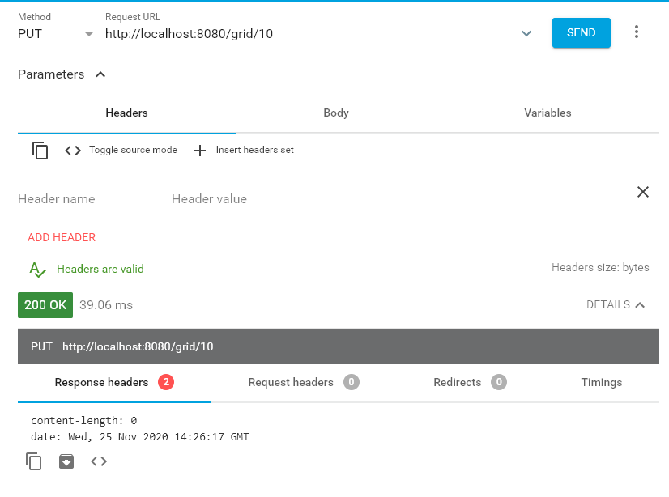
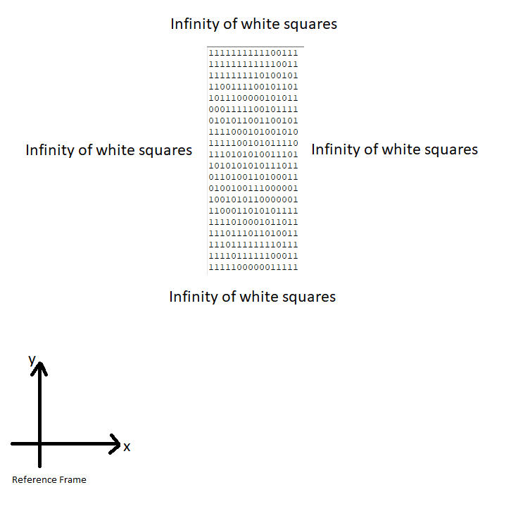

# Infinity Grid 
This project solves the following problem:

Consider an infinite grid of white and black squares. The grid is initially all white and there is a machine in one cell facing right. It will move based on the following rules:
 - If the machine is in a white square, turn 90° clockwise and move forward 1 unit;
 - If the machine is in a black square, turn 90° counter-clockwise and move forward 1 unit;
 - At every move flip the color of the base square.

Implement an application that will receive HTTP PUT requests with a number of steps the simulation should run, always starting from the same conditions, and output the resulting grid to a file.

## Description
By default, when a PUT request is made to the url */grid/{numberOfSteps}* (see below for the details), the application will create a text file containing the grid.

The file name will be **grid.txt** and will be saved in the user home directory (can be configured, see section below).
The representation of the grid will be a series of 1 for the white squares and 0 for the black squares (can be configured, see section below).

### Grid representation in the file
The principle of this representation is to show the smallest shape that can contains the black squares and **the surrounding infinity of white squares is not write in the file**.

If only a black square is present, then it will write only 0 and, again, all the infinity surrounding is made of white squares.
	  
If two black squares are present, it depends on their position on the plan, the final grid representation could be one of the following:

	0 0
or
		   
	0 1 0

or
	   
	1 1 0
	1 1 1
	0 1 1
	
etc.

## Requirements
In order to run this web application you'll need:
 - Java >= 8
 - Maven 3
 - IDE (Eclipse, IntelliJ IDEA, etc.)
 
## Project Configuration
The following parameters can be configured from the file src/main/resources/application.properties:
 - **threshold**: default value 65535. If the number of steps is under the threshold, then the in-memory representation of the grid will be used at runtime. Otherwise, the database implementation
 - **whiteSquare**: default value **1**. Is the graphical representation of the white square
 - **blackSquare**: default value **0**. Is the graphical representation of the black square
 - **infiniteWhites**: default value " ".Is the graphical representation of the grid containing only white squares
 - **outputFilePath**: the path of the folder that will contain the grid text file
 - **fileName**: default value **grid.txt** - the text file that will contain the graphical representation of the grid

## How to start the application with Maven
 1. Run `mvn clean install`
 2. Run `mvn spring-boot:run`
 
## How to start the application with Eclipse (it needs the Tool Suite plug-in)
 1. Right click on the project root folder
 2. Run AS -> Spring Boot App
 
 
## REST API
Method: 	**PUT**
URL   : 	/grid/{numberOfSteps}
Description: Generates a text file containing the graphical representation of the grid

### Parameter
 - **name**: numberOfSteps (required)
 
 - **type**: positive integer
 
### Responses

 - Code: **200**. *Description:* the file containing the grid was successfully generated
 - Code: **400**. *Description:* Client request not valid
 - Code: **500**. *Description:* Application error. The file was not generated
 
#### Example of request in localhost

 	

## Output Examples

1000 steps - grid.txt

